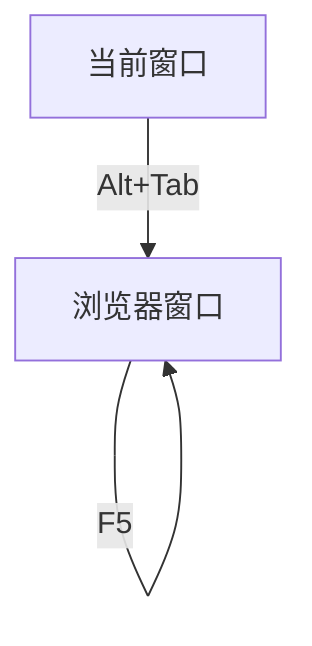

# SimpleRPA
基于图像识别的开源RPA工具，理论上可以支持所有windows软件和网页的自动化

## 简介
Autopy是一款python语言编写的开源RPA工具（桌面自动控制工具），用户可以通过配置yaml格式的文件，来实现桌面软件的自动化控制，简化繁杂重复的工作，比如运营人员给用户发消息，打标签，给店铺插旗；项目管理人员采集数据；测试人员实现简单的自动化测试等等。

## 为什么是SimpleRPA
* 这是一个基于MIT协议的开源项目，对商业应用友好
* 市面上常见的RPA工具，虽然功能强大完善，但基本上都基于过程控制的理念，实际上成了图形化编程工具，面对稍微复杂的场景，就需要编制大量的判断跳转和子流程嵌套；而autopy针对实际RPA场景做出了合理的抽象，虽然使用YAML格式配置，实际上是一种桌面自动控制的DSL，可以更便捷地表达自动化场景。
* 支持配置文件内嵌Python代码，可以实现更灵活的逻辑
* 基于图像采集、智能匹配和OCR识别，可以支持任何类型的桌面应用，而无需手工分析页面结构。

## 状态机概念
我们做屏幕自动化任务的时候，通常都会经历这样几个步骤：
1. 检查当前桌面上是否显示了需要的页面（比如查看特定位置的图像，或者比对OCR识别出的文字）
2. 如果确实是，就收集一些文字或图像的信息（这一步未必会有，要看具体任务类型，有些自动化只要把页面流程走通就可以）
3. 查找页面上特定的控件（比如某个按钮），对它进行操作（如点击）
4. 跳转到下一个页面，回到步骤1，反复循环，直到最终页面出现

Autopy把这个过程，抽象为一个状态机模型：每个页面是一个状态（state），通过“action”触发，可以跳转到下一个状态；
在每一个State内部，可以做check（检查是否需要的页面），可以find（查找特定控件，或者收集信息）；
针对find的结果，还可以形成子状态，来实现复杂的操作。

## 示例
Autopy的自动化脚本，由一个yaml配置文件，和子文件夹构成，文件夹中通常存放要查找的图像模板。

### 示例1——自动刷新页面
一个简单的配置文件示例如下：
```yaml
# 有一个特定的浏览器页面，我们需要定时刷新，以便更新它的状态
name: "浏览器自动刷新"
ver: 0.1
# 默认不会调整屏幕分辨率，所有内容里指定的坐标，都是相对于当前屏幕左上角；
# 但如果这里指定了屏幕宽度或高度，就会在开始运行内容之前，调整分辨率
# screen_width: 3440   
# screen_height: 1440
states:
  - name: "当前窗口"
    # 为了简化，这里假设当前桌面刚刚从浏览器窗口切换到脚本运行窗口，所以一启动就先用alt+tab键切换回去
    id: 1
    transition:
      # 通过点击热键这个action, 迁移到下一个状态
      action: hotkey('alt', 'tab')
      wait: 1
  - name: "浏览器窗口"
    id: 2
    check:
      image:
          snapshot: !rect l:0, r:60, t:113, b:182
          template: auto_test/detect_logo.png
          # debug: True
      fail_action: raise_error('当前页面不是期待的页面')
    transition:
      # 通过点击F5实现浏览器刷新，迁移前先等待60s；
      # 没有其他页面需要显示了，所以还是迁移到当前状态，无限循环
      action: hotkey('f5')
      wait: 60
      to: 2
```
上面这个示例可以用流程图表示如下:


这里states是一个列表，每个列表项是一个状态，每个状态有一个id属性作为唯一标识。状态之间的迁移，通过transition属性的to来指定。
to指定的内容可以是某一个state的id，也可以是next（缺省值），next意味着迁移到下一个状态（按列表定义顺序，而不是id编号顺序）。

transition的action是表示触发迁移的动作，支持键盘鼠标、屏幕、剪贴板、窗口引用（目前只支持windows）等一系列操作。
transition的wait表示动作执行以后，等待的时间。

这里的check属性里面定义了image，用来检测屏幕上特定区域是否显示了指定的图案，如果图案存在，说明正确进入了当前状态；
如果不存在，会触发fail_action的执行。

### 示例2——
自动归档trello任务。一个典型的trello归档页面如下：


下面的脚本，可以帮用户自动归档所有已完成的任务。

```yaml
name: "自动归档Trello"
ver: 0.5
#screen_width: 3440
#screen_height: 1440
range: !rect l:0, r:1920, t:0, b:1080
time_scale: 1
states:
  - name: "点击获取窗口焦点"
    id: 1
    transition:
      # 点击
      action: click(300, 20)
      wait: 1.5
      to: next
  - name: "已完成列表"
    id: 2
    transition:
      # 右击第一个卡片
      action: rightclick(1540, 290)
      wait: 1
      to: next
  - name: "右键菜单"
    id: 3
    find:
      image:
        snapshot: !rect l:1415, r:1805, t:239, b:609
        template: auto_trello/detect_target.png
        confidence: 0.8
      fail_action: raise_error('找不到归档按钮')
    transition:
      # 左击归档按钮
      action: click(1415 + state.find_result.center_x, 239 + state.find_result.center_y)
      wait: 1
      to: 2
      max_time: 2
```


## 配置类
实际上，每个配置项，都有对应的数据类型定义，autopy读取配置文件的时候，会通过objtyping把yaml数据转换为对应的类实例。

数据类型定义，请参照 [autopy 类图](docs/autopy_class_diagram.md)


本文档开头实例中的配置文件，转换之后的实例关系图如下：[autopy 示例对象图](docs/autopy_sample_object_diagram.md)


## 待实现
* 更方便的数据读取和采集模型（目前只能基于键盘鼠标操作实现）
* 图形化设计器（会先放出一个辅助截图工具）
* 可扩展的操作（这样就可以自己实现
* 发布到PyPI库，支持pip install 安装

