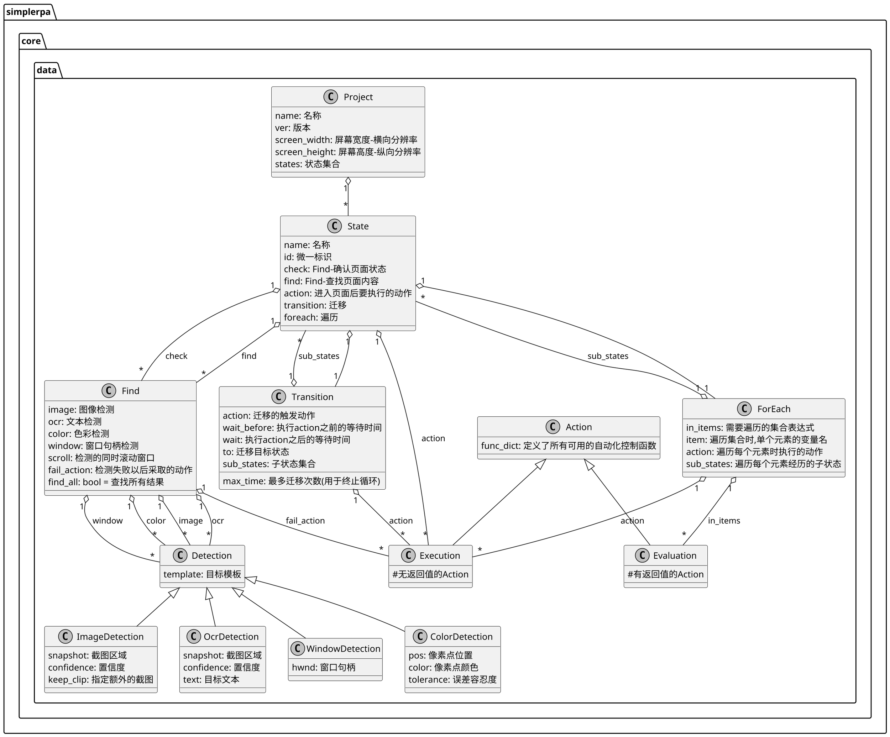

simplrpa 数据类型是通过class中的class attribute来定义的，而不是instance attribute，所以下图中看到的属性，都定义在class中，而不是__init__方法里：

```puml
@startuml
skinparam monochrome true
skinparam classAttributeIconSize 0
scale 2

namespace simplerpa {

	namespace core {

		namespace data {
		    class Project{
		        name: 名称
                ver: 版本
                screen_width: 屏幕宽度-横向分辨率
                screen_height: 屏幕高度-纵向分辨率
                states: 状态集合
		    }

		    class State{
                name: 名称
                id: 微一标识
                check: Find-确认页面状态
                find: Find-查找页面内容
                action: 进入页面后要执行的动作
                transition: 迁移
                foreach: 遍历
		    }

			class Find {
				image: 图像检测
                ocr: 文本检测
                color: 色彩检测
                window: 窗口句柄检测
                scroll: 检测的同时滚动窗口
                fail_action: 检测失败以后采取的动作
                find_all: bool = 查找所有结果
			}

			class Detection {
				template: 目标模板
			}

			class ImageDetection {
                snapshot: 截图区域
                confidence: 置信度
                keep_clip: 指定额外的截图
			}

			class OcrDetection {
                snapshot: 截图区域
                confidence: 置信度
                text: 目标文本
			}

			class WindowDetection {
				hwnd: 窗口句柄
			}

			class ColorDetection {
                pos: 像素点位置
                color: 像素点颜色
                tolerance: 误差容忍度
    		}

			class Transition {
				action: 迁移的触发动作
                wait_before: 执行action之前的等待时间
                wait: 执行action之后的等待时间
                to: 迁移目标状态
                sub_states: 子状态集合
                max_time: 最多迁移次数(用于终止循环)
			}

			class Action {
				func_dict: 定义了所有可用的自动化控制函数
			}

			class Evaluation {
			    # 有返回值的Action
			}
			class Execution {
			    # 无返回值的Action
			}

			class ForEach {
				in_items: 需要遍历的集合表达式
                item: 遍历集合时,单个元素的变量名
                action: 遍历每个元素时执行的动作
                sub_states: 遍历每个元素经历的子状态
			}

            Detection <|-- ImageDetection
            Detection <|-- OcrDetection
            Detection <|-- WindowDetection
            Detection <|-- ColorDetection
            
            Action <|-- Execution
            Action <|-- Evaluation
            
            Project "1" o-- "*" State
            State "1" o-- "*" Find: check
            State "1" o-- "*" Find: find
            State "1" o-- "1" Transition
            State "1" o-- "1" ForEach
            State "1" o-- "*" Execution : action
            
            Find "1" o-- "*" Detection : image
            Find "1" o-- "*" Detection : ocr
            Find "1" o-- "*" Detection : window
            Find "1" o-- "*" Detection : color
            
            Find "1" o-- "*" Execution : fail_action
            
            Transition "1" o-- "*" Execution : action
            Transition "1" o-- "*" State : sub_states
            
            ForEach "1" o-- "*" Evaluation : in_items
            ForEach "1" o-- "*" State : sub_states
            ForEach "1" o-- "*" Execution : action
		}
	}
}
@enduml
```
