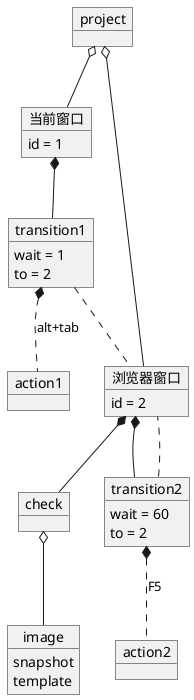

这是示例配置文件的对象实例图

```puml
@startuml
object project

object 当前窗口
    当前窗口 : id = 1
object 浏览器窗口
    浏览器窗口 : id = 2 
object check
object image
    image : snapshot
    image : template
object transition1
    transition1 : wait = 1
    transition1 : to = 2
object transition2
    transition2 : wait = 60
    transition2 : to = 2
object action1
object action2
    
project  o--  当前窗口
project  o--  浏览器窗口

transition1  ..  浏览器窗口 
transition2  ..  浏览器窗口

浏览器窗口 *-- check
check o-- image

当前窗口 *-- transition1
浏览器窗口 *-- transition2

transition1  *..  action1 : alt+tab
transition2  *..  action2 : F5

@enduml
```
